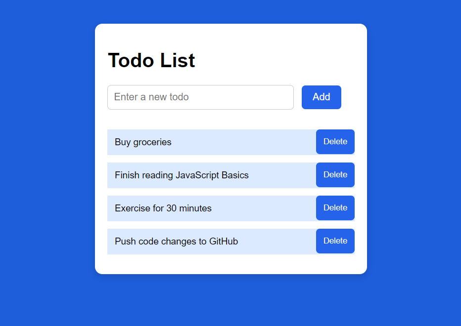

# 📝 Todo List App

A simple Todo List project built using **HTML, CSS, and JavaScript**.  
This app allows users to quickly add tasks, view them in a table, and remove them with a single click.

## 🚀 Features
- Add new todos using the input box
- Delete todos with a styled delete button
- Modern UI design with responsive layout
- Beginner-friendly project structure

## 📂 Tech Stack
- **HTML5** – Page structure
- **CSS3** – Styling (modern buttons & layout)
- **JavaScript (ES6)** – Add/Delete todo functionality

## 📸 Screenshot


## ⚡ How to Run
1. Clone this repository:
   ```bash
   git clone https://github.com/Dhivakar001/todo-list.git
